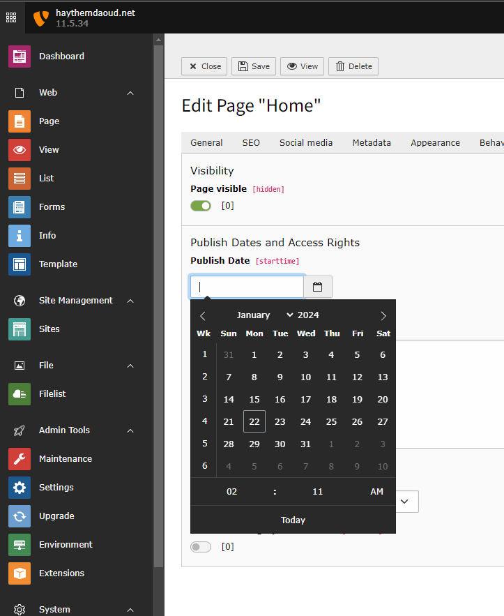

## Add "TODAY" Button to DateTimePicker for TYPO3 v11

- Clone TYPO3 v11 from github : https://github.com/TYPO3/typo3
- Run `cd ./Build/`
- Run `npm install` && `npm install shortcut-buttons-flatpickr`
- Copy changes from `./Build` directory to `TYPO3 Build folder`.
- Run `npm grunt build`
- Copy <b>DateTimePicker.js</b>, <b>InputDateTimeElement</b> and <b>shortcut-buttons.min</b> 
- Extend **InputDateTimeElement class** using XClass and change this code snippet

`$resultArray['requireJsModules'][] = JavaScriptModuleInstruction::forRequireJS(
  'TYPO3/CMS/YourExtensionName/Backend/FormEngine/Element/InputDateTimeElement'
  )->instance($fieldId);`

